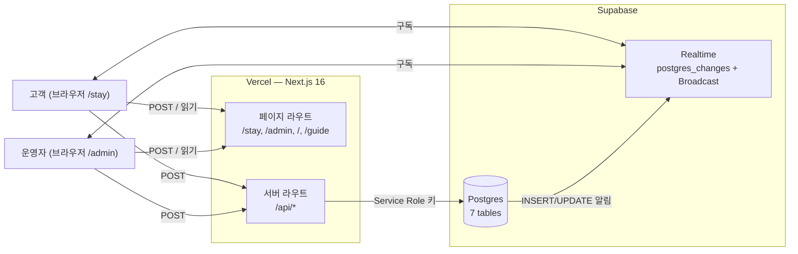
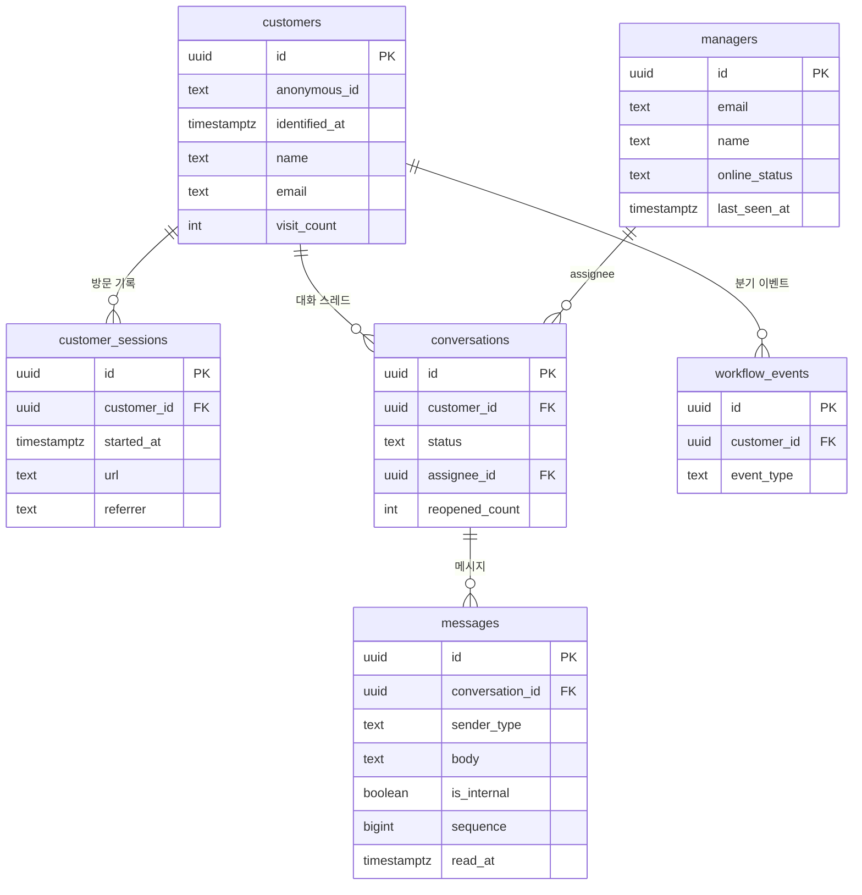
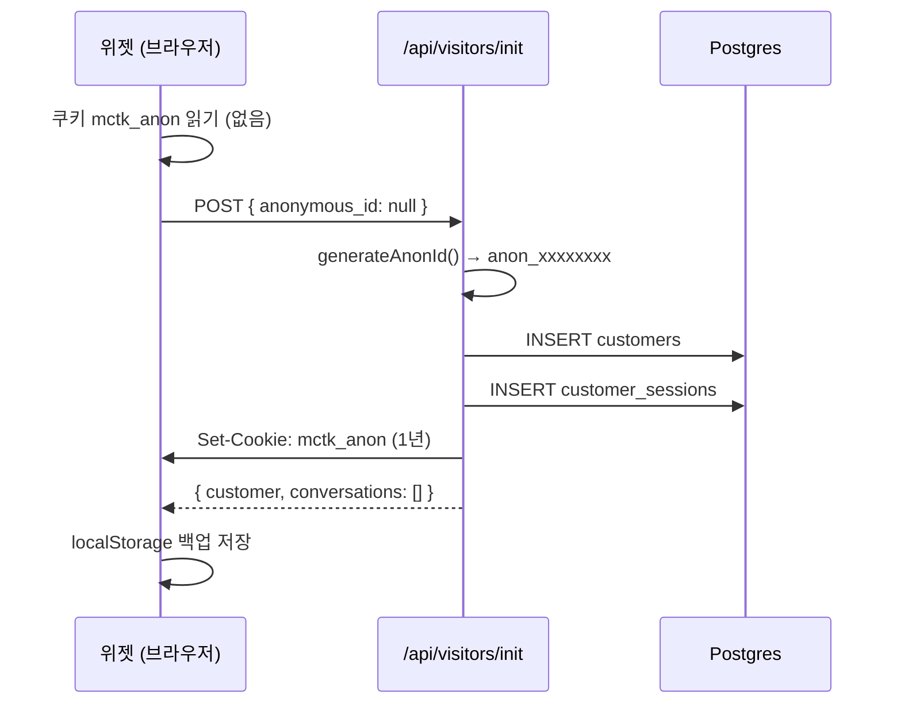
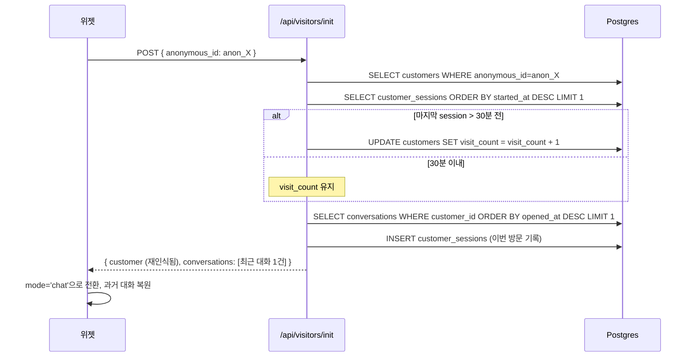
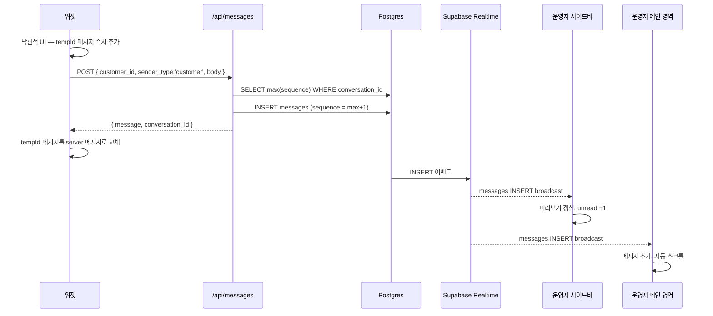
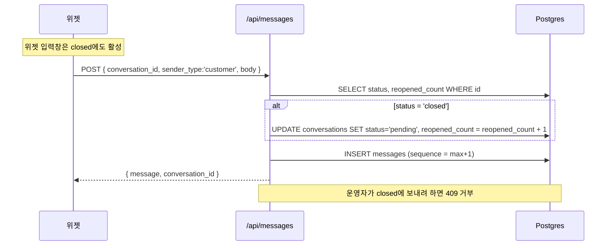
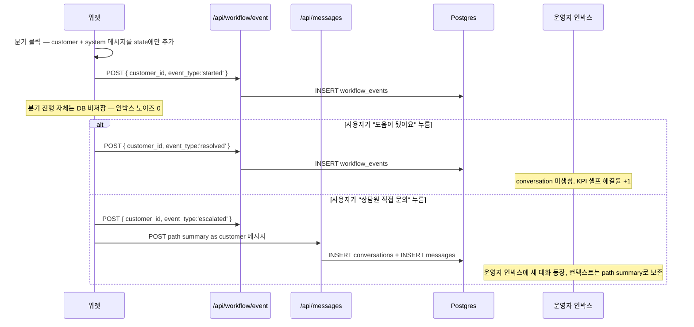

# Mini Channel Talk — 아키텍처 메모

> 이 문서는 미니 채널톡이 어떤 부품으로 구성되고, 데이터가 어떻게 흐르며, 어떤 트레이드오프를 받아들였는지를 정리한 메모입니다. 의사결정 문서가 *왜*에 답한다면, 이 문서는 *어떻게*에 답합니다.

- 라이브: <https://mini-ch-talk.vercel.app/>
- 의사결정 문서: [`./DECISION.md`](./DECISION.md)
- KPI 시트: [`./KPI_SHEET.md`](./KPI_SHEET.md)

---

## 1. 한 문단 요약

미니 채널톡은 *고객 위젯*, *운영자 콘솔*, *공유 데이터베이스* 세 부분으로 구성됩니다. 셋 다 같은 Next.js 16 앱 안에 들어가 있고, 백엔드는 Supabase 한 덩어리(Postgres + Realtime)로 통합했습니다. 모든 쓰기 작업은 Next.js의 `/api` 서버 라우트가 Service Role 키로 처리하고, 브라우저는 anon 키로 *읽기와 Realtime 구독*만 수행합니다. 이 분리가 보안과 시연성을 동시에 가져갑니다. 양쪽 화면은 Supabase Realtime의 `postgres_changes` 모드로 DB row 변화를 직접 받기 때문에, 한 번의 INSERT가 위젯·운영자 사이드바·운영자 메인 영역 세 화면을 동시에 갱신합니다.

---

## 2. 시스템 구성도



**핵심 결정 두 가지**

- **쓰기는 모두 서버 라우트 통과.** 브라우저가 Supabase에 직접 쓰지 않습니다. `sequence` 부여·`reopen` 분기·KPI 이벤트 기록 같은 *비즈니스 로직*이 서버에 응집됩니다.
- **읽기와 Realtime 구독은 브라우저에서 직접.** 서버를 한 단계 우회하면 지연이 늘어나고 fan-out 비용이 커집니다. RLS는 데모 한정으로 비활성, Service Role 키는 *서버에만*.

---

## 3. 데이터 모델 — 7개 테이블



**핵심 모델링 결정**

> *customer가 conversation보다 먼저 존재하고, 한 customer가 여러 conversation을 가질 수 있다.*

이게 “*같은 사람을 두 번째 방문에서 알아본다*”의 데이터적 증거입니다. 평범한 채팅 클론은 conversation을 root로 두지만, 미니 채널톡은 *customer-as-root*입니다.

- `customers.anonymous_id` — `anon_xxxxxxxx` 형태 12자리 랜덤 ID. 쿠키와 localStorage 양쪽에 깔립니다.
- `customers.visit_count` — *진짜* 재방문 횟수. 새로고침이 +1이 아닙니다. 30분 inactivity 게이트(자세한 건 §6.2)로 증가합니다.
- `conversations.status` — `pending | active | closed`. customer-side reopen 정책으로 *closed에서 새 메시지 = 자동 reopen*.
- `messages.is_internal` — 운영자만 보는 내부 메모. 위젯 측 fetch와 Realtime 핸들러 두 군데에서 필터링.
- `workflow_events` — 워크플로우 트리 분기 이벤트(`started | escalated | resolved`). 셀프 해결률 KPI의 원천.
- `faq_entries`(미사용) — F11 임베딩 매칭 빌드를 디퍼하면서 *스키마만* 남겼습니다. 시드와 호출 코드는 없습니다.

**Realtime publication 등록 (4개):** `customers`, `messages`, `conversations`, `managers`. 이 4개 테이블의 row 변화가 구독 중인 모든 브라우저에 자동 broadcast됩니다.

---

## 4. 데이터 흐름

### 4.1 첫 방문 — 익명 ID 발급



쿠키 + localStorage 이중화는 *쿠키가 사라진 환경에서도 같은 사람으로 묶기* 위해서입니다. 둘 다 사라지면 서버가 새 anon_id를 발급합니다.

### 4.2 재방문 — 같은 사람으로 인식



이 30분 게이트는 Intercom과 GA4가 쓰는 *web session* 표준에 맞췄습니다. 그렇지 않으면 새로고침 한 번이 +1로 잡혀서 *재인식률* KPI가 부풀려집니다. 자세한 배경은 의사결정 문서 §7.2를 참고하세요.

### 4.3 메시지 송수신 — 한 번의 INSERT가 세 화면을 갱신



같은 INSERT 한 번이 publication을 통해 *운영자 측 두 채널*에 동시에 broadcast됩니다. 사이드바의 각 row와 메인 영역이 서로 다른 채널을 구독 중입니다.

운영자 답장도 같은 경로의 반대 방향이고, `is_internal=true`인 내부 메모는 위젯 측에서 두 겹(`is_internal=false` 필터 + Realtime 핸들러 reject)으로 막아 *고객에게 절대 가지 않습니다*.

### 4.4 닫힌 대화 — 고객이 다시 열기



채널톡 본 제품 패턴과 동일한 *customer-side thread continuity*입니다. *재오픈률* KPI가 의미 있는 숫자가 되는 자리입니다.

### 4.5 워크플로우 트리 — 분기 진행은 클라이언트 only



이 분리가 두 가지 목적을 동시에 달성합니다.

- *운영자 인박스에 노이즈가 안 쌓입니다.* 분기만 보고 나간 사용자도 conversation이 만들어지면 인박스가 의미 없는 row로 차게 됩니다.
- *셀프 해결률 KPI가 측정 가능해집니다.* `workflow_events`에 `resolved | escalated`만 카운트하면 분모가 깔끔합니다.

---

## 5. Realtime의 두 모드

미니 채널톡은 Supabase Realtime을 두 모드로 분리해서 씁니다.

### 5.1 `postgres_changes` — DB에 박힌 영속 신호

- **동작:** 테이블 row에 INSERT/UPDATE/DELETE가 일어나면 publication을 통해 구독자에게 자동 broadcast.
- **사용처:** 메시지·대화 상태·매니저 온라인/오프라인·고객 식별 정보, 네 개 흐름.
- **비유:** 우체국 등기우편. 내용물(row)이 도중에 사라지지 않습니다.

### 5.2 `Broadcast` — DB와 무관한 ephemeral 신호

- **동작:** 클라이언트끼리 직접 신호만 주고받음. 어디에도 저장되지 않음.
- **사용처:** 타이핑 인디케이터 하나뿐. `typing:${conversation_id}` 채널에서 1500ms throttle, 3초 무음 시 사라짐.
- **비유:** 핸드폰 진동. 그 순간만 의미 있고 1초 뒤엔 가치 없음.

타이핑 신호를 DB에 박지 않은 이유는 — *지금 이 순간만 의미 있는 신호*가 DB에 박히면 부하 낭비 + publication 잡음 증가이기 때문입니다.

---

## 6. 보안 / 인증 모델

### 6.1 Supabase 키 분리

- `NEXT_PUBLIC_SUPABASE_ANON_KEY` — 브라우저에 노출. SELECT와 Realtime 구독만 허용 (RLS 정책 따름). 데모는 RLS 비활성화로 풀 읽기 가능.
- `SUPABASE_SERVICE_ROLE_KEY` — 서버에만 존재. 모든 row 무제한 접근. 모든 mutation은 서버 라우트를 통해 이 키로만 수행.

### 6.2 익명 ID 관리 (자체 구현)

Supabase Anonymous Auth를 *의식적으로 사용하지 않았습니다*. 이유는 — 익명에서 식별로 넘어가는 메커니즘이 *코드와 DevTools에서 직접 보이지 않으면* 미니 채널톡의 핵심 thesis(*컨텍스트 누적*) 시연이 약해지기 때문입니다.

구현은 `lib/anon-id.ts`에 응집됩니다.

```text
generateAnonId()         → anon_ + 12자리 base62 랜덤
readAnonIdFromBrowser()  → 쿠키 → localStorage 백업 → null
writeAnonIdToBrowser()   → 쿠키 (1년) + localStorage 동시 기록
```

### 6.3 매니저 인증 (데모 한정)

- `/admin?as=demo-manager` 진입 시 서버 액션이 쿠키 `mctk_demo_admin = demo-manager@example.com` 세팅
- 이후 모든 server component가 이 쿠키로 `managers` 테이블 조회
- 프로덕션이라면 OAuth + 권한 모델이 필수. 의사결정 문서 §4.1에 트레이드오프로 명시.

---

## 7. 의도적인 약점 (받아들인 트레이드오프)

> 모두 인지 후 의식적으로 받아들인 결정입니다. 의사결정 문서 §4와 §7.2에 entry로 기록돼 있습니다.

| # | 약점 | 데모에서 안전한 이유 | 프로덕션이라면 |
|---|---|---|---|
| 1 | **RLS 비활성화** | Service Role 키는 서버에만, 브라우저는 anon 키로 read-only | 정교한 RLS 정책 + 매니저 권한 모델 |
| 2 | **매니저 multi-tab presence race** | 단일 매니저 + 단일 탭 가정 | Realtime Presence API 또는 `manager_sessions` 별도 테이블 |
| 3 | **N채널 fan-out** | 데모 부하(시드 5-7건)에서 비용 무시 가능 | 단일 채널 + 클라이언트 디스패치로 합치기 |
| 4 | **메시지 `sequence` 두 statement race** | 동시 INSERT 거의 없음 | SERIALIZABLE 트랜잭션 또는 PostgreSQL advisory lock |
| 5 | **낙관적 UI 자동 재시도 미구현** | 데모 환경 네트워크 실패 확률 낮음 | 1s/2s/4s exponential backoff + 큐잉 |
| 6 | **워크플로우 진행 상태 클라이언트 only** | 데모 시연 흐름에서 새로고침 안 함 | localStorage 또는 server-side step 저장 |
| 7 | **인증 우회 (`?as=demo-manager`)** | 데모 평가자 마찰 최소화 | OAuth + 권한 모델 |

---

## 8. 진화 경로 — ALF로 가는 길

```
[현재 미니]   고객 접점·컨텍스트 substrate
                    ↓
[Next 1]      운영자 측 ALF Lite — 추천 응답 사이드 패널
                    ↓ (RAG)
[Next 2]      도큐먼트 풀버전 + RAG 그라운디드 응답
                    ↓
[Next 3]      워크플로우 + 액션 가능한 에이전트 = 풀 ALF
                    ↓
[Next 4]      다채널 어댑터 (인스타·라인·이메일·카카오)
```

미니 설계가 이 경로와 정합하는 이유 세 가지:

- 인박스 추상화 — 다채널 어댑터 확장 가능
- *customer-as-root* 모델 — 컨텍스트 그래프의 backbone
- `faq_entries` 스키마 — F11 디퍼했지만 ALF substrate 시그널은 데이터 모델에 미리 박혀 있음

---

## 9. 기술 스택 요약

| 영역 | 선택 | 버전 |
|---|---|---|
| 웹 프레임워크 | Next.js (App Router) | 16.2.6 |
| 언어 | TypeScript strict | ^5 |
| 스타일 | Tailwind CSS | v4 |
| UI 런타임 | React | 19.2.4 |
| Postgres + Realtime | Supabase | @supabase/ssr ^0.10.3 |
| 호스팅 | Vercel | — |

**직접 구현한 영역** (인프라가 아닌 *해석을 증명하는 디테일*)

- 익명 식별 (쿠키 + localStorage + 서버 머지 + 30분 게이트)
- 대화 상태 머신과 customer-side reopen 정책
- 워크플로우 트리(클라이언트 only) 및 path summary escalate
- KPI 6개 계산 (`lib/kpi.ts`)
- 타이핑 인디케이터 채널 추상화 (`lib/typing-indicator.ts`)

**의도적으로 빌리고 직접 짜지 않은 영역**

- WebSocket 재연결·백프레셔·메시지 순서 보장 → Supabase Realtime
- 사용자/매니저 인증 인프라 → 데모용 쿠키 우회
- 호스팅 인프라 → Vercel

---

## 10. 더 읽을 자료

- [`./DECISION.md`](./DECISION.md) — 모든 *왜*의 원본. 빌드 우선순위, 트레이드오프, 받아들인 손실, 실투입 시간.
- [`./KPI_SHEET.md`](./KPI_SHEET.md) — 7개 지표의 정의·측정 SQL·고객사 의미.
- [`/guide`](https://mini-ch-talk.vercel.app/guide) — 14개 핵심 기능별 체크리스트.
