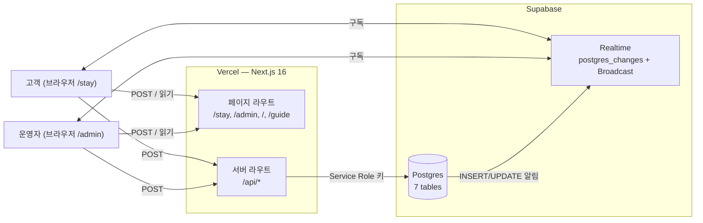
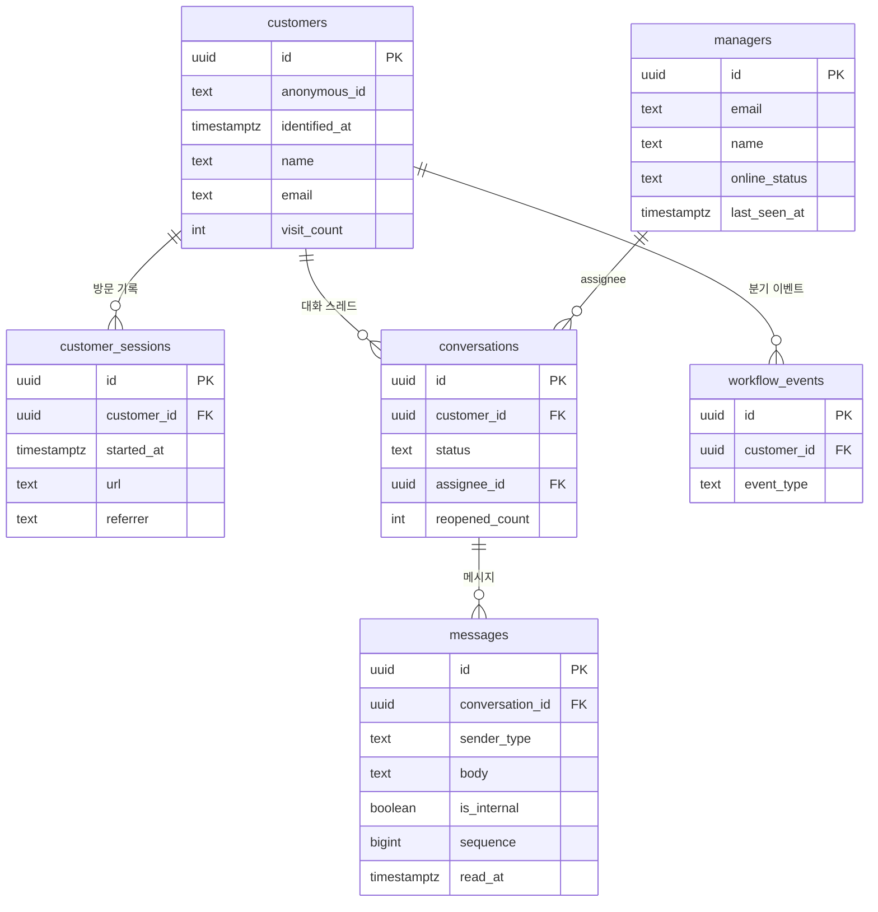
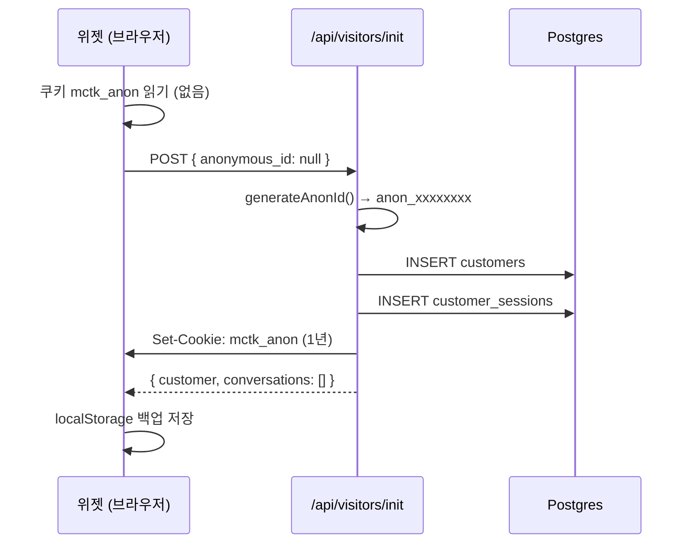
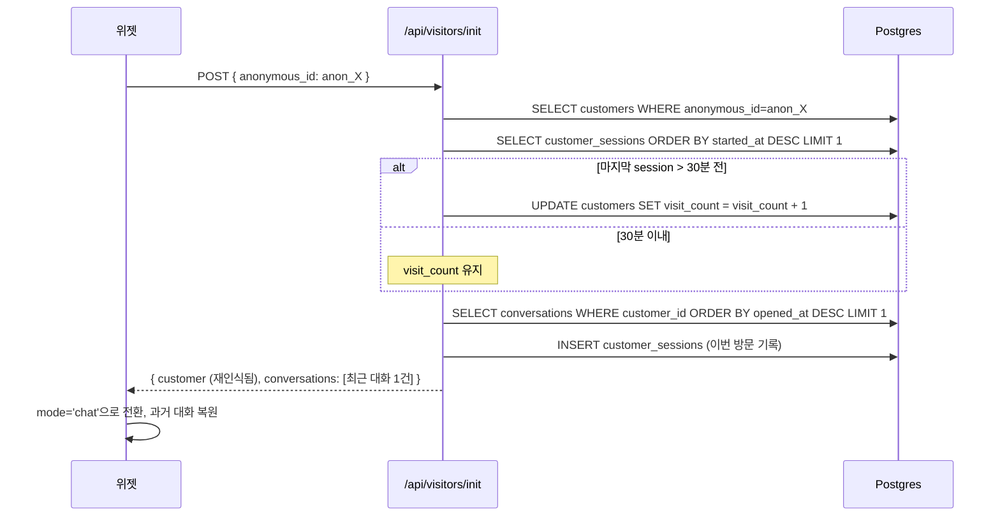
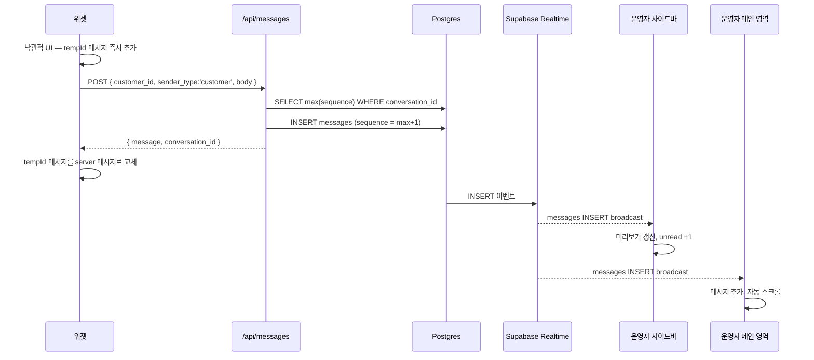
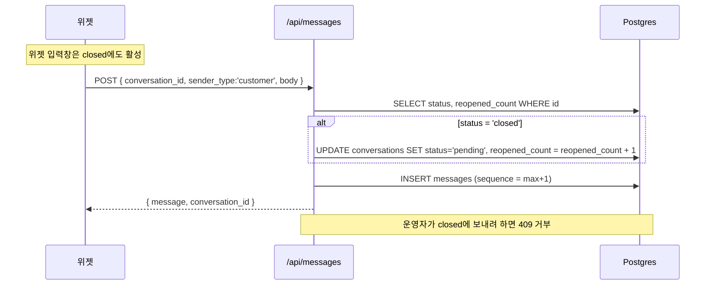
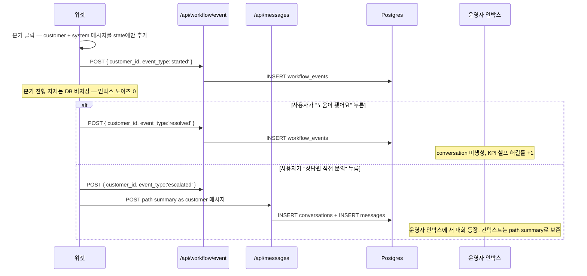

# Mini Channel Talk — 아키텍처

---


## 1. 시스템 구성도



---

## 2. 데이터 모델



> *customer가 conversation보다 먼저 존재하고, 한 customer가 여러 conversation을 가질 수 있다. (Conversation-as-root -> Customer-as-root)* 

- `customers.anonymous_id` — `anon_xxxxxxxx` 12자리 랜덤 ID. 쿠키와 localStorage 양쪽에 깔립니다.
- `customers.visit_count` — 재방문 횟수. 30분 inactivity 게이트로 증가
- `conversations.status` — `pending | active | closed`. customer-side reopen 정책으로 *closed에서 새 메시지 = 자동 reopen*.
- `messages.is_internal` — 운영자만 보는 내부 메모. 위젯 측 fetch와 Realtime 핸들러 두 군데에서 필터링.
- `workflow_events` — 워크플로우 트리 분기 이벤트(`started | escalated | resolved`). 셀프 해결률 KPI 참고용.

**Realtime publication 등록 (4개):** `customers`, `messages`, `conversations`, `managers`. 이 4개 테이블의 row 변화가 구독 중인 모든 브라우저에 자동 broadcast됨

---

## 3. 데이터 흐름

### 3.1 첫 방문 — 익명 ID 발급



쿠키 + localStorage 이중화는 *쿠키가 사라진 환경에서도 같은 사람으로 묶기* 위함. 둘 다 사라질 경우 서버가 새 anon_id를 발급.

### 3.2 재방문 — 같은 사람으로 인식



### 3.3 메시지 송수신 — 한 번의 INSERT가 세 화면을 갱신



같은 INSERT 한 번이 publication을 통해 운영자 측 두 채널에 동시에 broadcast. 사이드바의 각 row와 메인 영역이 서로 다른 채널을 구독.

운영자 답장도 같은 경로의 반대 방향이고, `is_internal=true`인 내부 메모는 위젯 측에서 두 겹(`is_internal=false` 필터 + Realtime 핸들러 reject)으로 막아 고객에게 발송되지 않음.

### 3.4 닫힌 대화 — 고객이 다시 오픈



### 3.5 워크플로우 트리 — 클라이언트 only



- 운영자 인박스에 노이즈 X
- 셀프 해결률 KPI 측정 가능

---

## 4. Realtime의 두 모드

### 4.1 `postgres_changes`

- **동작:** 테이블 row에 INSERT/UPDATE/DELETE가 일어나면 publication을 통해 구독자에게 자동 broadcast.
- **사용처:** 메시지·대화 상태·매니저 온라인/오프라인·고객 식별 정보, 네 개 흐름.

### 4.2 `Broadcast`

- **동작:** 클라이언트끼리 직접 신호만 주고받음. 어디에도 저장되지 않음.
- **사용처:** 타이핑 인디케이터. `typing:${conversation_id}` 채널에서 1500ms throttle, 3초 무음 시 사라짐.

## 5. 로드맵

```
[현재 버전]     고객 접점·컨텍스트 substrate
                    ↓
[Next 1]      운영자 측 ALF Lite — 추천 응답 사이드 패널
                    ↓ (RAG)
[Next 2]      도큐먼트 풀버전 + RAG 그라운디드 응답
                    ↓
[Next 3]      워크플로우 + 액션 가능한 에이전트 = 풀 ALF
                    ↓
[Next 4]      다채널 어댑터 (인스타·라인·이메일·카카오)
```

미니 설계가 이 경로와 정합하는 이유 세 가지:

- 인박스 추상화 — 다채널 어댑터 확장 가능
- *customer-as-root* 모델 — 컨텍스트 그래프의 backbone
- `faq_entries` 스키마 — F11 디퍼했지만 ALF substrate 시그널은 데이터 모델에 미리 박혀 있음

---

## 6. 기술 스택 요약

| 영역 | 선택 |
|---|---|
| 웹 프레임워크 | Next.js (App Router)|
| 언어 | TypeScript strict|
| 스타일 | Tailwind CSS|
| UI 런타임 | React|
| Postgres + Realtime | Supabase|
| 호스팅 | Vercel|

**인프라 활용**

- WebSocket 재연결·백프레셔·메시지 순서 보장 → Supabase Realtime
- 사용자/매니저 인증 인프라 → 데모용 쿠키 우회
- 호스팅 인프라 → Vercel

**디테일 구현**

- 익명 식별 (쿠키 + localStorage + 서버 머지 + 30분 재방문 인식 게이트)
- 대화 상태 머신과 customer-side reopen 정책
- 워크플로우 트리 - 클라이언트 only
- KPI 6개 계산 (`lib/kpi.ts`)
- 타이핑 인디케이터 채널 추상화 (`lib/typing-indicator.ts`)